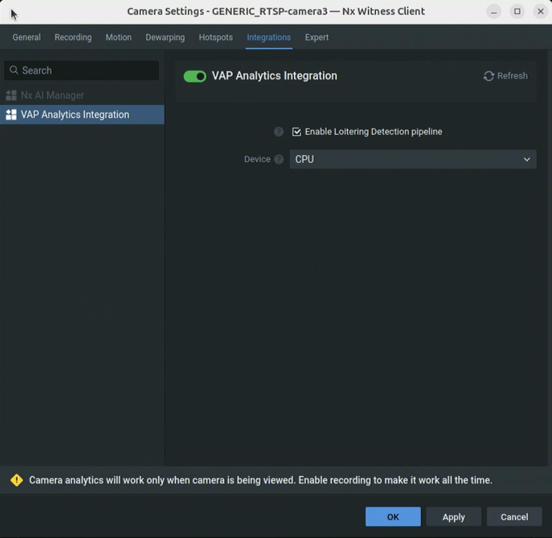

# Tutorial: Loitering Detection with Nx Witness

This tutorial walks through the end-to-end setup of Loitering Detection (a general
DL Streamer-based vision application) as an Analytics Application in VMS Adapter Plugin (VAP),
with Nx Witness as the VMS. At the end of this tutorial, you will have:

- Loitering Detection application running with its MQTT broker exposed to the host
- Nx Witness connected to VAP and automatically registered as an analytics integration
- Detection bounding boxes pushed from the application to Nx Witness in real time
- Pipeline runs managed from the VAP provider dashboard

> **Note:** Although this tutorial demonstrates Loitering Detection as an analytics application,
> the same instructions apply to any other DL Streamer-based vision application.

## Prerequisites

- A host machine running the Ubuntu OS (version 22.04 or 24.04) with Docker and Docker Compose
  installed.
- An Nx Witness server (version 5.x or above) accessible over the network from the VAP host.
  Nx Witness admin credentials are required.
- The `edge-ai-suites` repository cloned (sparse or full):

  ```bash
  git clone --filter=blob:none --sparse --branch release-2026.2.0 https://github.com/open-edge-platform/edge-ai-suites.git
  cd edge-ai-suites
  git sparse-checkout set metro-ai-suite manufacturing-ai-suite
  ```

## Architecture Overview

```text
Nx Witness VMS
  Camera device ─── RTSP stream ───────────────────────────────────────►┐
  (receives analytics       ◄─── REST push (bounding boxes) ────────────┤
   object overlays)                                                     │
                                                                        │
VMS Adapter Plugin (VAP)                                                │
  ┌──────────────────────────────────────┐                              │
  │  ObjectDetectionAnalyticsAppShim     │                              │
  │  ┌─────────────────────────────┐     │                              │
  │  │  POST /pipelines/{name}     ├───────────────────────────────────►│
  │  └─────────────────────────────┘     │  DL Streamer Pipeline Server │
  │                                      │   (Loitering Det application)│
  │  ┌─────────────────────────────┐     │       │                      │
  │  │  MqttSubscriber             │◄────────────┘  MQTT inference      │
  │  │  translate_dls_metadata()   │     │           results            │
  │  │  NxWitnessVmsShim.push()    ├───────────────────────────────────►│
  │  └─────────────────────────────┘     │
  └──────────────────────────────────────┘
                                         MQTT Broker (port 1883)
                                         (part of `dls_vision` stack)
```

**Key data flows:**

1. VAP sends `POST /pipelines/user_defined_pipelines/loitering_detection_vms_mqtt` to the
   DL Streamer Pipeline Server, specifying the camera RTSP URL as source and an MQTT topic as
   destination.
2. `dls_vision`'s DL Streamer Pipeline Server processes the RTSP stream, runs detection, and
   publishes inference metadata to the MQTT broker on topic `nx/dls_vision/{device_uuid}`.
3. VAP's `MqttSubscriber` receives the MQTT messages, translates DL Streamer GStreamer Video
   Analytics (GVA) JSON to Nx analytics object format, and calls
   `NxWitnessVmsShim.push_analytics_objects()`.
4. Nx Witness receives the push and overlays bounding boxes on the camera feed.

## Part 1 — Set Up the Loitering Detection Application

### 1.1 Configure the Loitering Detection Environment

Clone the `edge-ai-suites` repository as instructed in the setup document, and install Loitering
Detection according to the Loitering Detection
[Get Started Guide](https://docs.openedgeplatform.intel.com/2026.2/edge-ai-suites/loitering-detection/get-started.html#set-up-and-first-use).

Do not bring up the application yet.

> **Note:** The setup generates a `docker-compose.yml` file.

### 1.2 Verify the MQTT Port Exposure and Set the MQTT Host for the DL Streamer Pipeline Server

The Docker Compose stack includes an Eclipse Mosquitto MQTT broker. Confirm that port `1883`
is published to the host in `docker-compose.yml`, and set `MQTT_HOST` so the DL Streamer Pipeline
Server can publish to it:

```yaml
broker:
  image: docker.io/library/eclipse-mosquitto:2.0.21
  ports:
    - "1883:1883"

dlstreamer-pipeline-server:
  environment:
    - MQTT_HOST=${HOST_IP} # we set to HOST_IP as broker is running in the same host
    - MQTT_PORT=1883
```

This is the default configuration. The Mosquitto broker uses an anonymous-access configuration
(`allow_anonymous true`), which is required for the VMS Analytics Plugin and the DL Streamer
Pipeline Server to publish and subscribe without credentials.

> **Important:** The plugin connects to this MQTT broker from outside the `dls_vision` Docker
> network. The broker must be reachable at `<HOST_IP>:1883` from the plugin's container. If VAP
> runs on the same host, `host.docker.internal` resolves to the host from inside the plugin
> container.

### 1.3 Start the Loitering Detection Application

Start the application:

```bash
docker compose up -d
```

## Part 2 — Set Up Nx Witness

### 2.1 Install and Start Nx Witness Server

Install or start Nx Witness Server on a machine reachable from the VAP host. Refer to the
[Nx Witness documentation](https://www.networkoptix.com/nx-witness/) for installation
instructions.

After installation, verify the Nx Witness REST API is accessible:

```bash
curl -k -s https://<NX_HOST_IP>:7001/rest/v4/info | python3 -m json.tool | grep '"name"\|"version"'
```

### 2.2 Enable Digest Authentication for RTSP

VAP constructs RTSP URLs in the following format and passes them directly to the DL Streamer
Pipeline Server:

```
rtsp://<NX_USERNAME>:<NX_PASSWORD>@<NX_HOST_IP>:7001/<device-uuid>?onvif_replay=true
```

The Nx Witness RTSP server is exposed on the **same port as the REST API** (default `7001`). It
uses **digest authentication**, meaning the username and password embedded in the URL are
verified with an MD5 challenge-response — credentials are never sent in plaintext over the wire.

For analytics applications such as DL Streamer to successfully connect to these RTSP URLs, two
things must be confirmed in Nx Witness:

#### 2.2.1 Enable "Digest Authentication for RTSP" in System Settings

By default, newer Nx Witness versions restrict legacy RTSP clients to bearer-token authentication
only. To allow digest authentication (which GStreamer's `rtspsrc` element and most analytics
frameworks require):

1. Open the **Nx Witness desktop client** and connect to your server.
2. Go to **Main Menu** (hamburger icon) → **User Management**. This opens the Site Administration
   window.
3. Select the user account VAP will use to connect. This opens the User window.
4. Under **Info**, check **Allow insecure (digest) authentication**. Re-enter the
   password, and click **OK**.
5. Click **Apply**.


> **Why this is needed:** GStreamer's `rtspsrc` element (used by DL Streamer) negotiates
> authentication via the standard RTSP `DESCRIBE` challenge. If Nx only accepts bearer tokens
> (HTTP Authorization header), the GStreamer client cannot authenticate, and the pipeline
> immediately fails with `401 Unauthorized`.

#### 2.2.2 Confirm the User Has "View Live Video" Permission

> **Note:** Ignore the following if `NX_USERNAME` is an administrator.

The credentials embedded in the RTSP URL (`NX_USERNAME` / `NX_PASSWORD`) must belong to a user
with at least the **Live Viewer** role on all cameras used for analytics.

To verify or assign the role in the Nx Witness client:

1. Go to **Main Menu** → **User Management** (or **System Administration** → **Users**).
2. Find the user account matching `NX_USERNAME`.
3. Confirm the role is **Live Viewer**, **Advanced Viewer**, or **Administrator**.
4. If you are using a dedicated service account (recommended over using the `admin` account
   directly), ensure the account is assigned to all relevant camera groups.

#### 2.2.3 Verify RTSP Access from the Analytics Host

Before starting the full pipeline, verify the RTSP URL is reachable from the machine that will
run the DL Streamer Pipeline Server:

You can test with GStreamer directly:

The `<device-uuid>` value can be found in the Nx Witness client. Right-click a camera in the
list, and choose **Camera Settings**. In the camera settings window, under the **General** tab,
look for the **Camera ID**.

To run this test in a DL Streamer Pipeline Server container:

```bash
docker run -it --entrypoint bash  --rm --net host  intel/dlstreamer-pipeline-server:latest
```

Then run the GStreamer command:

```bash
gst-launch-1.0 rtspsrc \
  location="rtsp://<NX_USERNAME>:<NX_PASSWORD>@<NX_HOST_IP>:7001/<device-uuid>?onvif_replay=true" \
  ! fakesink
```

A pipeline that runs for a few seconds without errors confirms the RTSP connection is working.

### 2.3 Add Cameras to Nx Witness

In the Nx Witness desktop client:

1. Open **Server** → **Add Device** (or right-click the server in the resource tree).
2. Add cameras by entering their RTSP URLs or by using automatic discovery on the network.
3. Confirm each camera appears in the resource tree and shows a live feed.

Note the **Device ID**, a Universally Unique Identifier (UUID), of each camera you intend to
use. You can find this in:

- Nx Witness desktop client: right-click a camera → **Camera Settings** → **Information** tab.
- Or via the REST API:

  ```bash
  curl -k -u admin:<password> https://<NX_HOST_IP>:7001/rest/v4/devices | python3 -m json.tool | grep '"id"\|"name"'
  ```

### 2.4 Allow API Integration Registration Requests

In the Nx Witness desktop client:

1. Go to **Main Menu** → **System Administration**.
2. In the window, click **Integrations**.
3. In the **Manage Integrations** window, go to the **Settings** tab, and check *Accept API
   Integrations registration requests* to enable REST-based API integration.
4. Click **OK**.


## Part 3 — Configure VAP for `dls_vision` and Nx Witness

### 3.1 Prepare the VAP Environment File

Navigate to the VAP directory:

```bash
cd metro-ai-suite/vms-adapter-plugin
cp .env.example .env
```

Edit `.env` with the following values for the `dls_vision` and Nx Witness scenario:

```bash
# PostgreSQL
PG_PASSWORD=changeme

# Nx Witness
NX_HOST=<NX_HOST_IP>
NX_USERNAME=admin
NX_PASSWORD=<nx_admin_password>
NX_TLS_VERIFY=false
NX_CA_BUNDLE=

# dls_vision / DL Streamer Pipeline Server
# Hostname as seen from inside the VAP container.
# If dls_vision runs on the same host: use host.docker.internal
DLS_VISION_HOST=host.docker.internal
DLS_VISION_PORT=8080
DLS_VISION_TLS_VERIFY=false
DLS_PIPELINE_CPU=object_tracking_cpu
DLS_PIPELINE_GPU=object_tracking_gpu
DLS_PIPELINE_NPU=
DLS_VISION_CA_BUNDLE=

# MQTT Broker — address as seen by VAP (subscribing from outside the dls_vision Docker network)
# If dls_vision runs on the same host: use host.docker.internal
MQTT_HOST=host.docker.internal
MQTT_PORT=1883

# DLS Vision App MQTT — broker address as seen by VAP (for subscribing)
MQTT_HOST=
MQTT_PORT=1883

# VAP ports
UI_HTTPS_PORT=3443

# MQTT Broker host for VAP's own broker (used by LVC; leave empty if not using LVC)
MQTT_BROKER_HOST=
MQTT_BROKER_PORT=1883
```

`NX_TLS_VERIFY` and `DLS_VISION_TLS_VERIFY` are `false` by default for compatibility with
self-signed certificates. Set either value to `true` to enforce certificate verification. When
enabled, set the matching `*_CA_BUNDLE` to a Certificate Authority (CA) certificate path that
exists inside the `vms-adapter-backend` container.

### 3.2 Configure VAP `config.yaml`

Open `config/config.yaml`, and confirm the following sections match your setup. The file
uses `${ENV_VAR}` placeholders resolved from `.env` at startup.

**Nx Witness VMS instance:**

```yaml
vms_instances:
  - name: nx-main
    vendor: nx_witness
    base_url: "https://${NX_HOST}:7001"
    tls_verify: ${NX_TLS_VERIFY:-false}
    tls_ca_bundle: "${NX_CA_BUNDLE:-}"
    auth:
      username: "${NX_USERNAME}"
      password: "${NX_PASSWORD}"
      auth_type: digest
```

The `analytics_manifest_path` is **optional**. VAP automatically uses the bundled manifest at
`vms_shim/nxwitness/nx_integration.json` when this field is absent. Set it only if you need to
supply a custom manifest.

**`dls_vision` Analytics App:**

```yaml
analytics_apps:
  - type: object_detection
    app_id: "dls_vision"
    display_name: "Loitering Detection"
    base_url: "http://${DLS_VISION_HOST:-host.docker.internal}:${DLS_VISION_PORT:-8080}/pipelines"
    tls_verify: ${DLS_VISION_TLS_VERIFY:-false}
    tls_ca_bundle: "${DLS_VISION_CA_BUNDLE:-}"
    mqtt_host: "${MQTT_HOST:-host.docker.internal}"
    mqtt_port: ${MQTT_PORT:-1883}
    pipeline:
      cpu: ${DLS_PIPELINE_CPU:-}
      gpu: ${DLS_PIPELINE_GPU:-}
      npu: ${DLS_PIPELINE_NPU:-}
    label_type_map:
      vehicle: vap.vehicle
      pedestrian: vap.pedestrian
      background: vap.background
```

At least one of `DLS_PIPELINE_CPU`, `DLS_PIPELINE_GPU`, or `DLS_PIPELINE_NPU` must be set.
In the Nx UI, the **Device** dropdown only shows configured devices, and selecting one starts
the corresponding configured pipeline with the same device in `detection-properties.device`.

### 3.3 Configure the `label_type_map`

The `label_type_map` translates DL Streamer detection labels (from the model) into Nx Witness
object typeIds. These typeIds are automatically added to the Nx analytics manifest at startup,
so Nx knows which object types to expect.

**How it works:**

- When `dls_vision` detects a `"pedestrian"`, VAP pushes it to Nx as typeId `"vap.pedestrian"`.
- Nx renders this as an object overlay on the camera feed with the label `"vap.pedestrian"`.
- Labels not listed in the map fall back to `"python.detected.object"`.

**Customize for your model:** If your model detects labels different from the ones listed above
(for example, `"car"`, `"person"`, etc.), add them to the map.

```yaml
label_type_map:
  car: vap.vehicle
  truck: vap.vehicle
  bus: vap.vehicle
  motorcycle: vap.vehicle
  bicycle: vap.vehicle
  van: vap.vehicle
  person: vap.person
  pedestrian: vap.person
```

Any `vap.*` typeId you add here is automatically registered in the Nx manifest. You do not need
to manually edit `vms_shim/nxwitness/nx_integration.json`.

## Part 4 — Start VAP and Verify Nx Integration Registration

### 4.1 Build and Start VAP

Go to app directory
```bash
cd metro-ai-suite/vms-adapter-plugin
```

#### 4.1.1 Build from source (Optional):
```bash
docker compose build
```
> **Note:** You can skip this optional step since `docker compose up -d` that is run later in this document automatically pulls the required images.

#### 4.1.2 Start VAP
```bash
docker compose up -d
```

Check that all VAP services are healthy:

```bash
docker compose ps
```

Expected output:

```text
NAME                          STATUS
vms-adapter-backend           Up (healthy)
vms-adapter-ui                Up
vms-adapter-postgres          Up (healthy)
```

### 4.2 Understand Automatic Integration Registration

When VAP starts, the Orchestrator automatically registers the analytics integration with Nx
Witness. You do not need to register it manually. The process is:

1. VAP reads the integration manifest — the bundled `vms_shim/nxwitness/nx_integration.json`
   by default, or a custom path if `analytics_manifest_path` is set in `config.yaml`.
2. Any `label_type_map` entries from `config.yaml` are merged into the manifest automatically
   (so Nx knows all typeIds without manual edits).
3. VAP calls `POST /rest/v4/analytics/integrations/*/requests` on the Nx API.
4. VAP immediately approves the request via `POST .../requests/{requestId}/approve`.
5. Nx returns integration user credentials (`username`, `password`), which VAP stores in
   PostgreSQL and uses for subsequent metadata pushes.

Verify in the VAP logs:

```bash
docker compose logs vms-adapter-backend | grep -i "nx_integration\|autoregist"
```

You should see entries like:

```text
nx_integration_approved username=VAP Analytics Integration request_id=...
nx_integration_autoregistered vms=nx-main analytics_app_id=VAP Analytics Integration status=approved
```

> **If VAP has already registered before** (database record exists and integration exists in
> Nx), VAP restores the integration credentials from its database and skips re-registration. You
> will see:
>
> ```text
> nx_integration_already_registered vms=nx-main analytics_app_id=VAP Analytics Integration
> nx_integration_credentials_restored vms=nx-main username=VAP Analytics Integration
> ```

### 4.3 Verify the Integration in Nx Witness

To confirm the integration was registered, check via the Nx Witness REST API:

```bash
curl -k -u admin:<password> https://<NX_HOST_IP>:7001/rest/v4/analytics/integrations \
  | python3 -m json.tool | grep '"name"\|"id"\|"status"'
```

You should see an integration named `VAP Analytics Integration` with `"status": "active"` or
equivalent.

In the Nx Witness desktop client, navigate to **System Administration** → **Analytics** (or
**Plugins**) to see the integration listed.

## Part 5 — Enable the Analytics Integration for a Camera

Before VAP can push detection overlays to a specific camera, the analytics integration must be
enabled for that camera device in Nx Witness. VAP does this automatically on the first metadata
push for a device (by calling `PATCH /rest/v4/analytics/engines/{engineId}/deviceAgents/{deviceId}`
with `{"isEnabled": true}`), but you can also enable it manually in advance.

### 5.1 Enable via the Nx Witness Desktop Client

1. In the Nx Witness desktop client, close any open camera visualizer window.
2. Navigate to the left panel, and under the server, find the camera you wish to run analytics on and right-click to open context menu.
3. Select **Camera Settings**.
4. Go to the **Integrations** tab.
5. Find **VAP Analytics Integration** in the list.
6. Toggle the switch to **Enable**.
7. Click **Apply** or **OK**.

Repeat for each camera you plan to use with `dls_vision`.

### 5.2 Enable via the Nx Witness REST API (Optional)

First, get the analytics engine ID:

```bash
ENGINE_ID=$(curl -k -u admin:<password> \
  https://<NX_HOST_IP>:7001/rest/v4/analytics/engines \
  | python3 -c "
import json, sys
engines = json.load(sys.stdin)
for e in engines:
    if 'DLStreamer' in e.get('name', ''):
        print(e['id'])
")
echo "Engine ID: $ENGINE_ID"
```

Enable the integration for a specific camera device:

```bash
DEVICE_ID=<camera-device-uuid>

curl -k -u admin:<password> \
  -X PATCH \
  -H "Content-Type: application/json" \
  -d '{"isEnabled": true}' \
  "https://<NX_HOST_IP>:7001/rest/v4/analytics/engines/${ENGINE_ID}/deviceAgents/${DEVICE_ID}"
```

A `200 OK` response confirms the device agent is enabled.

> **Note:** VAP also performs this step automatically on the first push for a device ("lazy
> enablement"). If you start a pipeline run before enabling manually, VAP enables the device
> agent and pushes the manifest on the first detection.

## Part 6 — Start a Pipeline Run

The recommended way to start and stop a pipeline is directly from the **Nx Witness desktop
client**. VAP polls the Nx Witness API every 5 seconds and reacts to per-camera settings changes
automatically — no dashboard interaction is needed.

### 6.1 Discover Cameras

Before starting a pipeline, VAP must know about your cameras. Trigger discovery once after VAP
starts:

```bash
curl -k -X POST https://localhost:3443/v1/cameras/discover
```

Or open the dashboard at `https://localhost:3443`, and click **Discover Cameras** in the Camera
Discovery panel. Cameras are stored in PostgreSQL and reused across restarts.

### 6.2 Start the Pipeline from the Nx Witness Client (Recommended)

#### 6.2.1 Open Camera Settings

1. Open the **Nx Witness desktop client** and connect to your server.
2. In the resource tree, right-click the camera you want to enable analytics on.
3. Select **Camera Settings**.

#### 6.2.2 Navigate to the Integration Panel

1. In the Camera Settings window, click the **Integrations** tab.
2. Click **VAP Analytics Integration** to expand the per-camera settings.

You will see:

| Field                                   | Type     | Description                                  |
| --------------------------------------- | -------- | -------------------------------------------- |
| **Enable Loitering Detection Pipeline** | Checkbox | Starts or stops the pipeline for this camera |
| **Device**                              | Dropdown | Inference device: `CPU`, `GPU`, or `NPU`     |



#### 6.2.3 Enable the Pipeline

1. Select the **Device** from the dropdown (e.g., `GPU`).
2. Check the **Enable Loitering Detection Pipeline** checkbox.
3. Click **Apply**, and then **OK**.

VAP detects the change within 5 seconds, and starts the pipeline. Check the VAP
logs to confirm:

```bash
docker compose logs -f vms-adapter-backend
```

Expected output:

```text
[info] {'source': {'uri': '<rtsp_url>', 'type': 'uri', 'properties': {'protocols': 'tcp',
        'add-reference-timestamp-meta': True, 'latency': 100}},
  'destination': {'metadata': {'type': 'mqtt', 'topic': 'nx/dls_vision/<device-uuid>'}},
        'parameters': {'detection-properties': {'device': 'GPU'}}}
[info]  od_run_started  pipeline=user_defined_pipelines/loitering_detection_vms_mqtt run_id=<hex-instance-id>
[info]  nx_pipeline_started app_id=dls_vision device_id=<device-uuid> run_id=<hex-instance-id>
```

#### 6.2.4 Stop the Pipeline

1. Re-open **Camera Settings → Integrations → VAP Analytics Integration**.
2. Uncheck the **Enable Loitering Detection Pipeline** checkbox.
3. Click **Apply**, and then **OK**.

VAP stops the run on the next poll.

Expected log output:

```text
[info] nx_pipeline_stopped     app_id=dls_vision device_id=<device-uuid> run_id=<hex-instance-id> success=True
```

> **Note:** To run Loitering Detection and Live Video Captioning simultaneously, see the
> [Run Both Applications Simultaneously](./run-simultaneous-apps.md) guide.

### 6.3 Start the Pipeline from the VAP Dashboard (Optional)

<!--hide_directive
<details>
<summary>hide_directive-->Click to expand — start a pipeline from the provider dashboard
<!--hide_directive</summary>
hide_directive-->

#### Open the Dashboard

Open a browser and navigate to `https://localhost:3443`.

#### Enable a Camera for Analytics

In the **Camera Discovery** panel, find the camera, and click the toggle to mark it as
**enabled**.

```bash
# Or via API:
curl -k -X POST https://localhost:3443/v1/cameras/enable \
  -H "Content-Type: application/json" \
  -d '{"camera_ids": ["nx:<device-uuid>"], "enabled": true}'
```

#### Configure and start a loitering detection pipeline run

1. In the **Analytics Engine** panel, click **Discover Apps**. Depending on your configuration,
   you should see **Loitering Detection** in the Analytics App section. Click the radio button.

2. The configuration form appears with the following fields:

   | **Field**               | **Description**                                                 |
   | ----------------------- | --------------------------------------------------------------- |
   | **Pipeline**            | Dropdown listing available pipeline templates from `dls_vision` |
   | **Camera**              | Dropdown listing enabled cameras discovered from Nx Witness     |
   | **Pipeline parameters** | Optional JSON object forwarded to the Pipeline Server           |

3. Select the target camera from the **Camera** dropdown (for example, `Bus stop camera 1`).

4. Select `loitering_detection_vms_mqtt` from the **Pipeline** dropdown.

   > This is the pipeline template that uses `gvametapublish` to forward inference metadata to
   > the MQTT broker. Other templates (for example, `loitering_detection_vms_mqtt`) are for
   > internal `dls_vision` use only, and do not forward metadata to VAP.

5. Optionally, set **Pipeline parameters** as a JSON object to override detection properties,
   for example:

   ```json
   {
     "detection-properties": {
       "model": "/home/pipeline-server/models/intel/pedestrian-and-vehicle-detector-adas-0001/FP16/pedestrian-and-vehicle-detector-adas-0001.xml",
       "device": "GPU"
     }
   }
   ```

6. Click **Start Analysis**.

#### Stop the Run

When you want to stop the detection, go back to the VAP dashboard **Analytics Engine
Configuration** panel for **DL Streamer Vision**, and click **Stop Analysis** on the active run.

Or, via the API:

```bash
curl -k -X DELETE https://localhost:3443/v1/analytics-apps/dls_vision/runs/<run_id>
```

This sends `DELETE /pipelines/<instance_id>` to the DL Streamer Pipeline Server, stopping the
GStreamer pipeline. The MQTT subscriber remains running (it reconnects on the next run start).

<!--hide_directive
</details>hide_directive-->

### 6.4 What Happens When VAP Starts a Pipeline

When VAP starts a pipeline run, it executes the following:

1. Resolves the selected `camera_id` (`nx:<uuid>`) to an RTSP URL using
   `NxWitnessVmsShim.get_live_stream_url()`.
2. Builds an MQTT publish topic: `nx/dls_vision/<device-uuid>` (the topic where `dls_vision`
   publishes, and VAP subscribes).
3. Sends `POST /pipelines/user_defined_pipelines/loitering_detection_vms_mqtt` to the DL Streamer
   Pipeline Server with the payload:

   ```json
   {
     "source": {
       "uri": "rtsp://admin:<password>@<NX_HOST_IP>:7001/<device-uuid>",
       "type": "uri",
       "properties": {
         "protocols": "tcp",
         "add-reference-timestamp-meta": true,
         "latency": 100
       }
     },
     "destination": {
       "metadata": {
         "type": "mqtt",
         "topic": "nx/dls_vision/<device-uuid>"
       }
     },
     "parameters": {
       "detection-properties": {
         "model": "<model-path>",
         "device": "<selected-device>"
       }
     }
   }
   ```

4. The Pipeline Server starts the GStreamer pipeline, consuming the RTSP stream and publishing
   inference results to the MQTT broker.
5. VAP's `MqttSubscriber` (running as a background task since startup) receives messages on
   the wildcard topic `+/dls_vision/+`.

## Part 7 — Observe Detection Overlays in Nx Witness

### 7.1 Open the Camera in Nx Witness Client

1. Open the Nx Witness desktop client and connect to your server.
2. Double-click the camera that you started the pipeline for.
3. The live video feed opens in a layout panel.
4. Click the **Object Search** button (or press **Alt+O**).

### 7.2 Verify Detections Are Appearing

Within a few seconds of starting the run, detection bounding boxes should appear overlaid on the
video feed:

- Each detected object (for example, `pedestrian`, `vehicle`, `background`) is shown as a colored
  rectangle.
- The label shows the Nx `typeId` (for example, `vap.pedestrian`, `vap.vehicle`, or
  `python.detected.object` for unmapped labels).


If detections do not appear, see the [Troubleshooting](#troubleshooting) section.

### 7.3 Stop the Plugin

To stop VAP, run:

```bash
docker compose down
```

> **Caution:** Be careful not to remove the volume with the `docker compose down -v` command,
> as this deletes the database, as well as any integration information and credentials you
> created. If this happens, the integration in Nx becomes stale. Either delete it from Nx Witness,
> or use a different VMS integration name in the `vms_shim/nxwitness/nx_integration.json` file.

## Troubleshooting

### Nx Integration Not Registered

**Symptom:** VAP logs show `nx_integration_exists_in_vms_not_in_db` or
`nx_integration_exists_in_db_not_in_vms`.

**Cause:** The Nx integration and the VAP database are out of sync (for example, the integration
was manually deleted from Nx, or the VAP database was cleared).

**Fix:**

1. In the Nx Witness client, delete the `VAP Analytics Integration` integration from **System
   Administration** → **Analytics**.
2. Drop the VAP integration record from the database:

   ```bash
   docker compose exec vms-adapter-postgres psql -U vms -d vms_plugin \
     -c "DELETE FROM nx_integrations WHERE vms_name = 'nx-main';"
   ```

3. Restart VAP to trigger fresh registration:

   ```bash
   docker compose restart vms-adapter-backend
   ```

### Detections Not Appearing in Nx

**Symptom:** Pipeline run is active, `dls_vision` logs show detections, but no overlays appear in
Nx.

**Checks:**

1. Verify VAP's MQTT subscriber is receiving messages:

   ```bash
   docker compose logs vms-adapter-backend | grep "mqtt_pushed_objects\|mqtt_no_objects\|mqtt_push_failed"
   ```

2. Confirm the MQTT topic matches. VAP subscribes to `+/dls_vision/+`. `dls_vision` publishes to
   the topic VAP sends in the pipeline start payload (`nx/dls_vision/<device-uuid>`). Both must
   match.

3. Verify MQTT connectivity from the VAP side:

   ```bash
   # Install mosquitto-clients if not present
   sudo apt-get install -y mosquitto-clients
   mosquitto_sub -h <HOST_IP> -p 1883 -t '#' -v
   ```

   Start a pipeline run, and check whether messages appear.

4. Confirm the analytics integration is enabled for the camera in Nx Witness (see
   [Part 5](#part-5--enable-the-analytics-integration-for-a-camera)).

5. Check the Nx push in VAP logs:

   ```bash
   docker compose logs vms-adapter-backend | grep "nx_push\|push_analytics\|device_agent"
   ```

### DL Streamer Pipeline Server Returns Error on Start

**Symptom:** Clicking **Start Run** shows an error; VAP logs show a non-2xx from the Pipeline
Server.

**Checks:**

- Confirm `DLS_VISION_HOST` and `DLS_VISION_PORT` in `.env` are reachable from inside the
  `vms-adapter-backend` container:

  ```bash
  docker compose exec vms-adapter-backend curl http://${DLS_VISION_HOST}:${DLS_VISION_PORT}/pipelines
  ```

- If `dls_vision` uses HTTPS (for example, via nginx on port 443), update `base_url` in
  `config.yaml` accordingly.
- Verify `loitering_` appears in the pipeline list returned by `GET /pipelines`.

### RTSP Stream Not Reachable from `dls_vision`

**Symptom:** Pipeline starts but immediately fails; DL Streamer logs show RTSP connection errors.

**Checks:**

- The Nx RTSP URL includes credentials and is formed as
  `rtsp://admin:<password>@<NX_HOST_IP>:7001/<device-uuid>?onvif_replay=true`. Confirm this URL is
  reachable from the `dls_vision` Docker network.
- If DL Streamer logs show `401 Unauthorized`, digest authentication is not enabled in Nx Witness.
  Enable it in **System Administration** → **Security** → **Allow digest authentication for
  cameras**, and retry. See [Part 2.2](#22-enable-digest-authentication-for-rtsp) for details.
- Add `<NX_HOST_IP>` to `no_proxy` in the `dls_vision` environment if a proxy is configured.

## Summary

| **Step** | **Where** |
| -------- | --------- |
| Start `dls_vision` with MQTT broker exposed to host | `metro-vision-ai-app-recipe/loitering-detection/` → `docker compose up -d` |
| **Nx Witness:** install Server + Client, add cameras, enable digest auth, enable API Integrations | Nx Witness Desktop Client |
| Configure Nx Witness connection and MQTT settings in `.env` | `metro-ai-suite/vms-adapter-plugin/.env` |
| Configure `app_id`, `display_name`, `label_type_map` in `config.yaml` | `config/config.yaml` |
| Start VAP (integration auto-registers on startup) | `cd metro-ai-suite/vms-adapter-plugin` → `docker compose up -d --build` |
| Discover cameras | Dashboard → Discover Cameras |
| Enable cameras for analytics | Dashboard → Camera toggle |
| **Nx Witness:** Start pipeline | Camera Settings → Integrations → VAP Analytics Integration → Enable checkbox |
| View detection overlays | Nx Witness client → live camera feed (Objects panel) |
| **Nx Witness:** Stop the run | Camera Settings → Integrations → VAP Analytics Integration → Uncheck the checkbox |
