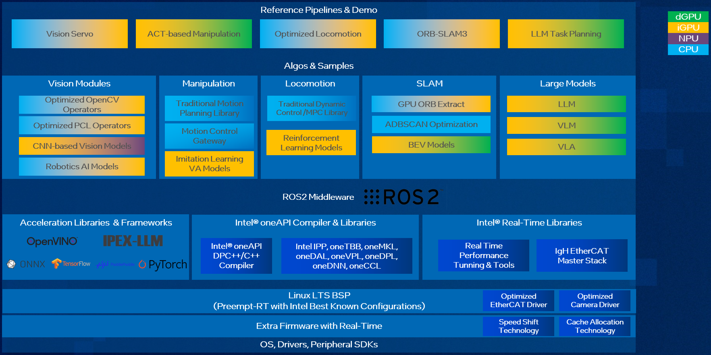

# Robotics AI Suite

The [Robotics AI Suite](https://eci.intel.com/embodied-sdk-docs/content/Intel_embodied_Intelligence_SDK.html) is a collection of intuitive, easy-to-use software stack designed to streamline the development process of Embodied Intelligence product and applications on Intel platform. The suite provides developers with a comprehensive environment for developing, testing, and optimizing Embodied Intelligence software and algorithms efficiently. It also provides necessary software framework, libraries, tools, Best known configuration(BKC), tutorials and example codes to facilitate AI solution development.

The Robotics AI Suite includes the below features:

- Comprehensive software platform from BSP, acceleration libraries, SDK to reference demos, with documentation and developer tutorials
- Real-time BKC, Linux RT kernel and optimized EtherCAT
- Traditional vision and motion planning acceleration on CPU, Reinforcement/Imitation Learning-based manipulation, AI-based vision & LLM/VLM acceleration on iGPU & NPU
- Typical workflows and examples including ACT/DP-based manipulation, LLM task planning, Pick & Place, ORB-SLAM3, etc

## Description

This software architecture is designed to power Embodied Intelligence systems by integrating computer vision, AI-driven manipulation, locomotion, SLAM, and large models into a unified framework. Built on ROS2 middleware, it takes advantage of Intel’s CPU, iGPU, dGPU, and NPU to optimize performance for robotics and AI applications. The stack includes high-performance AI frameworks, real-time libraries, and system-level optimizations, making it a comprehensive solution for Embodied Intelligence products.

At the highest level, the architecture is structured around key reference pipelines and demos that demonstrate its core capabilities. These include Vision Servo, which enhances robotic perception using AI-powered vision modules, and ACT-based Manipulation, which applies reinforcement learning and imitation learning to improve robotic grasping and movement. Optimized Locomotion leverages traditional control algorithms like MPC (Model Predictive Control) and LQR (Linear Quadratic Regulator), alongside reinforcement learning models for adaptive motion. Additionally, the ORB-SLAM3 pipeline focuses on real-time simultaneous localization and mapping, while LLM Task Planning integrates large language models for intelligent task execution.

Beneath these pipelines, the software stack includes specialized AI and robotics modules. The vision module supports CNN-based models, OpenCV, and PCL operators for optimized perception, enabling robots to interpret their surroundings efficiently. The manipulation module combines traditional motion planning with AI-driven control, allowing robots to execute complex movements. For locomotion, the system blends classic control techniques with reinforcement learning models, ensuring smooth and adaptive movement. Meanwhile, SLAM components such as GPU ORB extraction and ADBSCAN optimization enhance mapping accuracy, and BEV (Bird’s Eye View) models contribute to improved spatial awareness. The large model module supports LLMs, Vision-Language Models (VLM), and Vision-Language-Action Models (VLA), enabling advanced reasoning and decision-making capabilities.

At the core of the system is ROS2 middleware and acceleration frameworks, which provide a standardized framework for robotics development. The architecture is further enhanced by Intel’s AI acceleration libraries, including Intel® OpenVINO™ for deep learning inference, Intel® LLM Library for PyTorch* (IPEX-LLM) for optimized large model execution, and compatibility with TensorFlow*, PyTorch*, and ONNX*. The Intel® oneAPI compiler and libraries offer high-performance computing capabilities, leveraging oneMKL for mathematical operations, oneDNN for deep learning, and oneTBB for parallel processing. Additionally, Intel’s real-time libraries ensure low-latency execution, with tools for performance tuning and EtherCAT-based industrial communication.

To ensure seamless integration with robotic hardware, the suite runs on a real-time optimized Linux BSP. It includes support for optimized EtherCAT and camera drivers, along with Intel-specific features such as Speed Shift Technology and Cache Allocation to enhance power efficiency and performance. These system-level enhancements allow the software stack to deliver high responsiveness, making it suitable for real-time robotics applications.

Overall, the Robotics AI Suite provides a highly optimized, AI-driven framework for robotics and Embodied Intelligence, combining computer vision, motion planning, real-time processing, and large-scale AI models into a cohesive system. By leveraging Intel’s hardware acceleration and software ecosystem, it enables next-generation robotic applications with enhanced intelligence, efficiency, and adaptability.

## Collection

**AI Suite Pipelines:**

| Pipeline Name | Description |
| ------------- | ----------- |
| [Imitation Learning - ACT](orb-slam3-sample) | Imitation learning pipeline using Action Chunking with Transformers(ACT) algorithm to train and evaluate in simulator or real robot environment with Intel optimization |
| [VSLAM: ORB-SLAM3](act-sample) | One of popular real-time feature-based SLAM libraries able to perform Visual, Visual-Inertial and Multi-Map SLAM with monocular, stereo and RGB-D cameras, using pin-hole and fisheye lens models |

**Intel® OpenVINO™ optimized model algorithms:**

| Algorithm | Description |
| --------- | ----------- |
| [YOLOv8](https://eci.intel.com/embodied-sdk-docs/content/developer_tools_tutorials/model_tutorials.html#model-tutorials) | CNN based object detection |
| [YOLOv12](https://eci.intel.com/embodied-sdk-docs/content/developer_tools_tutorials/model_tutorials.html#model-tutorials) | CNN based object detection |
| [MobileNetV2](https://eci.intel.com/embodied-sdk-docs/content/developer_tools_tutorials/model_tutorials.html#model-tutorials) | CNN based object detection |
| [SAM](https://eci.intel.com/embodied-sdk-docs/content/developer_tools_tutorials/model_tutorials.html#model-tutorials) | Transformer based segmentation |
| [SAM2](https://eci.intel.com/embodied-sdk-docs/content/developer_tools_tutorials/model_tutorials.html#model-tutorials) | Extend SAM to video segmentation and object tracking with cross attention to memory |
| [FastSAM](https://eci.intel.com/embodied-sdk-docs/content/developer_tools_tutorials/model_tutorials.html#model-tutorials) | Lightweight substitute to SAM |
| [MobileSAM](https://eci.intel.com/embodied-sdk-docs/content/developer_tools_tutorials/model_tutorials.html#model-tutorials) | Lightweight substitute to SAM (Same model architecture with SAM. Can refer to OpenVINO SAM tutorials for model export and application) |
| [U-NET](https://eci.intel.com/embodied-sdk-docs/content/developer_tools_tutorials/model_tutorials.html#model-tutorials) | CNN based segmentation and diffusion model |
| [DETR](https://eci.intel.com/embodied-sdk-docs/content/developer_tools_tutorials/model_tutorials.html#model-tutorials) | Transformer based object detection |
| [DETR GroundingDino](https://eci.intel.com/embodied-sdk-docs/content/developer_tools_tutorials/model_tutorials.html#model-tutorials) | Transformer based object detection |
| [CLIP](https://eci.intel.com/embodied-sdk-docs/content/developer_tools_tutorials/model_tutorials.html#model-tutorials) | Transformer based image classification |
| [Action Chunking with Transformers - ACT](https://eci.intel.com/embodied-sdk-docs/content/developer_tools_tutorials/model_tutorials/model_act.html#model-act) | An end-to-end imitation learning model designed for fine manipulation tasks in robotics |
| [Feature Extraction Model: SuperPoint](https://eci.intel.com/embodied-sdk-docs/content/developer_tools_tutorials/model_tutorials/model_superpoint.html#model-superpoint) | A self-supervised framework for interest point detection and description in images, suitable for a large number of multiple-view geometry problems in computer vision |
| [Feature Tracking Model: LightGlue](https://eci.intel.com/embodied-sdk-docs/content/developer_tools_tutorials/model_tutorials/model_lightglue.html#model-lightglue) | A model designed for efficient and accurate feature matching in computer vision tasks |
| [Bird’s Eye View Perception: Fast-BEV](https://eci.intel.com/embodied-sdk-docs/content/developer_tools_tutorials/model_tutorials/model_fastbev.html#model-fastbev) | Obtaining a BEV perception is to gain a comprehensive understanding of the spatial layout and relationships between objects in a scene |
| [Monocular Depth Estimation: Depth Anything V2](https://eci.intel.com/embodied-sdk-docs/content/developer_tools_tutorials/model_tutorials/model_depthanythingv2.html#model-depthanythingv2) | A powerful tool that leverages deep learning to infer 3D information from 2D images |

