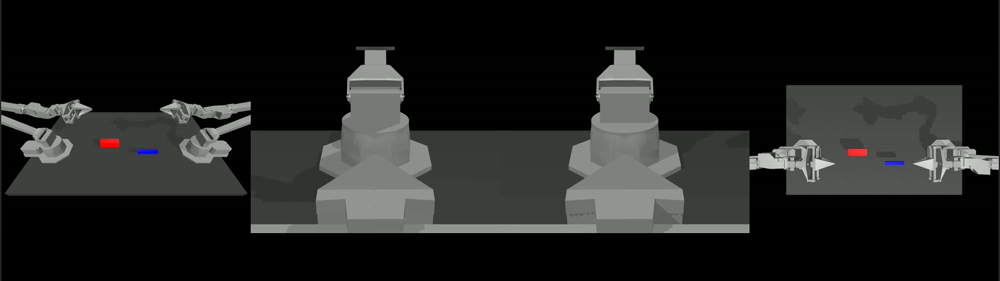
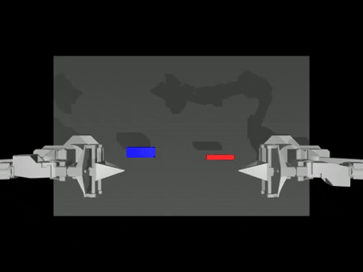

# Imitation Learning - ACT

Imitation learning is a machine learning approach where a model is trained to mimic expert behavior by observing and replicating demonstrations, enabling it to perform tasks similarly to the expert. ACT is an action chunking policy with Transformers, an architecture designed for sequence modeling, and train it as a conditional VAE (CVAE) to capture the variability in human data. It significantly outperforms previous imitation learning algorithms on a range of simulated and real-world fine manipulation tasks.

We have built an imitation learning pipeline for ACT, which can be used to train and evaluate the ACT model on different tasks both in simulation and real robot environment. In this sample pipeline, we provided source code optimized by Intel® Extension for PyTorch and Intel® OpenVINO™ to accelerate the process.

In this tutorial, we will introduce how to setup ACT pipeline.

## Prerequisites

Please make sure you have finished setup steps in [Installation & Setup](https://eci.intel.com/embodied-sdk-docs/content/installation_setup.html) and followed refer to [oneAPI doc](https://eci.intel.com/embodied-sdk-docs/content/developer_tools_tutorials/oneapi.html#oneapi-install-label) to setup Intel® oneAPI packages.

## Installation

### ALOHA real robot environment setup (Optional)

Follow the [stationary ALOHA guide](https://docs.trossenrobotics.com/aloha_docs/2.0/getting_started/stationary.html) to build real robot platform.

### Virtual environment setup

1. Create a Python 3.10 virtual environment with the following command:

```
$ sudo apt install python3-venv
$ python3 -m venv act
```

2. Activate the virtual environment with the following command:

```
$ source act/bin/activate
```

### Install Intel® Extension for PyTorch

> [!IMPORTANT]
> Intel® Extension for PyTorch workloads are incompatible with the NPU driver. For more details, please refer to the [Troubleshooting page](https://eci.intel.com/embodied-sdk-docs/content/troubleshooting.html).

Install the Intel® Extension for PyTorch with the following command:

```
$ pip install torch==2.3.1+cxx11.abi torchvision==0.18.1+cxx11.abi torchaudio==2.3.1+cxx11.abi intel-extension-for-pytorch==2.3.110+xpu oneccl_bind_pt==2.3.100+xpu ipex-llm==2.2.0b20241224 --extra-index-url https://pytorch-extension.intel.com/release-whl/stable/xpu/us/
```

### Install Intel® OpenVINO™

Install the Intel® OpenVINO™ with the following command:

```
$ pip install openvino==2024.6.0
```

### Dependencies setup

Install the dependencies with the following command:

```
$ pip install pyquaternion==0.9.9 pyyaml==6.0 rospkg==1.5.0 pexpect==4.8.0 mujoco==3.2.6 dm_control==1.0.26 matplotlib==3.10.0 einops==0.6.0 packaging==23.0 h5py==3.12.1 ipython==8.12.0 opencv-python==4.10.0.84 transformers==4.37.0 accelerate==0.23.0 bigdl-core-xe-21==2.6.0b2 bigdl-core-xe-addons-21==2.6.0b2 bigdl-core-xe-batch-21==2.6.0b2 huggingface-hub==0.24.7
```

### Install ACT package

The Embodied Intelligence SDK provides optimized source code for Intel® Extension for PyTorch and Intel® OpenVINO™. To get the source code with the following command:

For Intel® Extension for PyTorch:

```
$ sudo apt install act-ipex 
$ sudo chown -R $USER /opt/act-ipex/
```

For Intel® OpenVINO™:

```
$ sudo apt install act-ov
$ sudo chown -R $USER /opt/act-ov/
```

### Install DETR

Install the DETR with the following command:

```
$ cd <path_to_act>/detr/
$ pip install -e .
```

## Run pipeline

### Inference

1. You can download our pre-trained weights from this link: [Download Link](https://eci.intel.com/embodied-sdk-docs/_downloads/sim_insertion_scripted.zip). The command of training is the same as above, but you need to set the argument `--ckpt_dir` to the path of the pre-trained weights.

2. Convert the model checkpoint to OpenVINO IR **(Optional)**

`ov_convert.py` is a script provided to convert the PyTorch model to OpenVINO IR. You can find the script in the `act-ov` directory, and see the usage with the following command:

```
$ cd /opt/act-ov/
$ python3 ov_convert.py -h
```

For example, you can convert the model with the following command:

```
$ python3 ov_convert.py --ckpt_path <your_ckpt_path> --height 480 --weight 640 --camera_num 4 --chunk_size 100
```

> [!IMPORTANT]
> Please make sure the arguments `--chunk_size`, `--kl_weight`, `--hidden_dim`, `--dim_feedforward`, `--camera_num` are the same as the training arguments.

3. The pipeline supports configurations with up to four cameras. You can modify the `constants.py` file in the source directory to define the number of cameras. Below are examples of configurations for four cameras and one camera:

```
# In /opt/act-ov/constants.py
SIM_TASK_CONFIGS = {
    'sim_insertion_scripted': {
        'dataset_dir': DATA_DIR + '/sim_insertion_scripted',
        'num_episodes': 50,
        'episode_len': 400,
        'camera_names': ['top', 'angle', 'left_wrist', 'right_wrist']
    },
}

# In /opt/act-ipex/constants.py
SIM_TASK_CONFIGS = {
    'sim_insertion_scripted': {
        'dataset_dir': DATA_DIR + '/sim_insertion_scripted',
        'num_episodes': 50,
        'episode_len': 400,
        'camera_names': ['top']
    },
}
```

Below is a camera viewer showcasing four different camera perspectives, the left one is the `angle` camera, and the right one is the `top` camera. The middle two are the `left and right wrist` cameras, respectively.



4. Evaluate the policy with the following command:

```
$ python3 imitate_episodes.py --task_name sim_insertion_scripted --ckpt_dir <ckpt dir> --policy_class ACT --kl_weight 10 --chunk_size 100 --hidden_dim 512 --batch_size 8 --dim_feedforward 3200 --num_epochs 2000  --lr 1e-5 --seed 0 --device GPU --eval
```

> [!NOTE]
> `--eval` is used to evaluate the policy.
> `--device` is used to set the device to CPU or GPU.
> `--temporal_agg` can be used to enable the temporal aggregation algorithm.
> `--onscreen_render` can be used to enable onscreen rendering.

When the `--onscreen_render` parameter is enabled, the successful inference result appears as follows:



### Training **(Optional)**

> [!IMPORTANT]
> Please refer to the [ALOHA paper](https://arxiv.org/abs/2304.13705) for instructions on setting up a machine with the training environment.

1. Generate 50 episodes with the following command:

```
# Bimanual Insertion task
$ python3 record_sim_episodes.py --task_name sim_insertion_scripted --dataset_dir <data save dir> --num_episodes 50
```

2. Visualize the episode with the following command:

```
$ python3 visualize_episodes.py --dataset_dir <data save dir> --episode_idx 0
```

3. Train ACT with the following command:

```
# Bimanual Insertion task
$ python3 imitate_episodes.py --task_name sim_insertion_scripted --ckpt_dir <ckpt dir> --policy_class ACT --kl_weight 10 --chunk_size 100 --hidden_dim 512 --batch_size 8 --dim_feedforward 3200 --num_epochs 2000  --lr 1e-5 --seed 0
```
