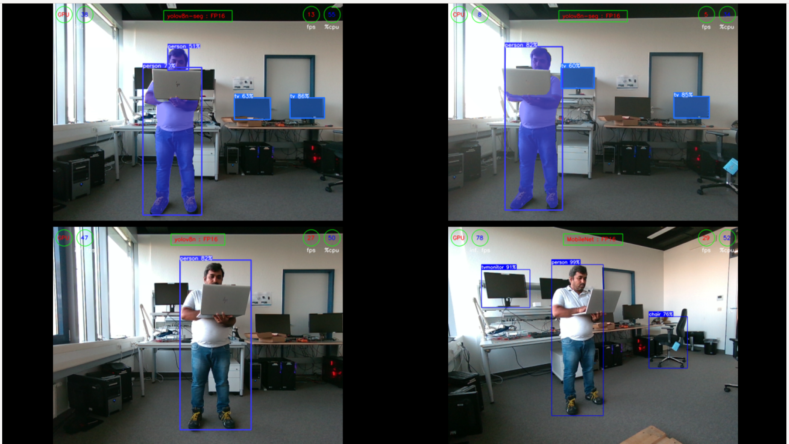

<!--
Copyright (C) 2025 Intel Corporation

SPDX-License-Identifier: Apache-2.0
-->

# Multi-Camera Demo (RealSense D457 AI Demo)

## Documentation

Comprehensive documentation on this component is available here: [dev guide](https://docs.openedgeplatform.intel.com/2026.2/edge-ai-suites/robotics-ai-suite/robotics/dev_guide/tutorials_amr/perception/openvino/pyrealsense2_d457_multicam_object_detection_tutorial.html).

## Overview

In this demo four instances of AI applications for object detection are run in parallel using four RealSense™ camera streams. The Ultralytics YOLOv8 model and mobilenet-ssd model are downloaded and used for object detection and segmentation.

The multicamera usecase is demonstrated using an Axiomtek Robox500 Industrial PC and 4x Intel® RealSense™ GMSL/FAKRA Stereo Camera D457. The Axiomtek Robox500 industrial PC consists of an 12th Gen Intel® Core™ i7-1270PE, 28W Alderlake P Processor and an Intel® Iris® Xe Graphics iGPU. However, this demo can be run on any Intel® platform which has a GPU and also with 4x USB Intel® RealSense™ cameras.

The setup looks like as described in the table below.
<!-- markdownlint-disable MD033 -->
|Camera  |AI Model          |AI Workload                     |Device|
|--------|------------------|--------------------------------|------|
|Camera-1|YOLOv8n-seg:FP16  |<ul><li>Object detection</li><li>Segmentation|GPU   |
|Camera-2|YOLOv8n-seg:FP16  |<ul><li>Object detection</li><li>Segmentation|CPU   |
|Camera-3|YOLOv8n:FP16      |Object detection                |GPU   |
|Camera-4|mobilenet-ssd:FP16|Object detection                |GPU   |

## Get Started

### System Requirements

Prepare the target system following the [official documentation](https://docs.openedgeplatform.intel.com/2026.2/edge-ai-suites/robotics-ai-suite/robotics/gsg_robot/index.html).

### Build

To build debian packages, export `ROS_DISTRO` env variable to desired platform and run `make package` command. After build process successfully finishes, built packages will be available in the root directory. The following command is an example for `Humble` distribution.

```bash
ROS_DISTRO=humble make package
```

You can list all built packages:

```bash
ls|grep -i .deb
```

```text
ros-humble-pyrealsense2-ai-demo_*_amd64.deb
ros-humble-pyrealsense2-ai-demo-build-deps_*_amd64.deb
```

`*build-deps*.deb` package is generated during build process and installation of such packages could be skipped on target platform.

To build Docker image:

```bash
make image
```

To clean all build artifacts:

```bash
make clean
```

### Install

If Ubuntu 22.04 with Humble is used, then run

```bash
source /opt/ros/humble/setup.bash
```

If Ubuntu 24.04 with Jazzy is used, then run

```bash
source /opt/ros/jazzy/setup.bash
```

Finally, install the Debian package that was built via `make package`:

```bash
sudo apt update
sudo apt install ./ros-${ROS_DISTRO}-pyrealsense2-ai-demo_*_amd64.deb
```

**Note:**

The ros-humble-pyrealsense2-ai-demo installation will also do the following:

* Installs all the python dependency packages needed for the demo to run.
* Downloads the YOLOv8 model files from Ultralytics and generate the models.
* Download and build the mobilenet-ssd model using the omz_downloader.

The installation will run for 25-30 minutes and consumes approx 2GB of the disk space.

### Test

To run unit tests execute the below command:

```bash
make test
```

### Development

There is a set of prepared Makefile targets to speed up the development.

In particular, use the following Makefile target to run code linters.

```bash
make lint
```

Alternatively, you can run linters individually.

```bash
make lint-bash
make lint-githubactions
make lint-json
make lint-markdown
make lint-python
make lint-yaml
```

To run license compliance validation:

```bash
make license-check
```

To see a full list of available Makefile targets:

```bash
make help
```

```text
Target               Description
------               -----------
default              Run demo
license-check        Perform a REUSE license check using docker container
lint                 Run all linters using super-linter
lint-all             Run super-linter over entire repository
lint-bash            Run Bash linter using super-linter
lint-githubactions   Run GitHub Actions linter using super-linter
lint-json            Run JSON linter using super-linter
lint-markdown        Run Markdown linter using super-linter
lint-python          Run Python linter using super-linter
lint-yaml            Run YAML linter using super-linter
image                Build Docker image
test                 Run unit tests in container
package              Build Debian packages in container
source-package       Create source package tarball
yolov8_models        Prepare the yolov8 models
mobilenet_models     Prepare the mobilenet models
models               Prepare all models (yolov8 and mobilenet)
demo                 Run the RealSense AI Demo
bash                 Open bash shell in container
clean                Remove Docker image
```

## Usage

### Platform-Specific Setup

#### Axiomtek Robox500 Platform

The following steps are required in order to enable Axiomtek Robox500 platform to support 4x Intel® RealSense™ GMSL/FAKRA Stereo Camera D457.

To start with, connect the 4x Intel® RealSense™ GMSL/FAKRA Stereo Camera D457 to the Axiomtek Robox500 platform as shown in the below picture. Remove any USB Intel® RealSense™ cameras if connected. Now, power-on the target.


#### BIOS Settings

Press "Del" or "Esc" button at boot to go into the BIOS. Once in the BIOS, set the following BIOS settings.

* Intel Advanced Menu -> Power & Performance -> CPU-Power Management Control -> C States -> < Disable > (Note: If enabled, fps drops)
* Intel Advanced Menu -> System Agent (SA) Configuration -> MIPI Camera Configuration -> < Enable > (Note: Enable all four cameras in this menu)

|BIOS Setting       |Camera 1|Camera 2|Camera 3|Camera 4|
|-------------------|--------|--------|--------|--------|
|MIPI Port          |0       |1       |2       |3       |
|LaneUser           |x2      |x2      |x2      |x2      |
|PortSpeed          |2       |2       |2       |2       |
|I2C Channel        |I2C5    |I2C5    |I2C5    |I2C5    |
|Device0 I2C Address|12      |14      |16      |18      |
|Device1 I2C Address|42      |44      |62      |64      |
|Device2 I2C Address|48      |4a      |68      |6C      |

##### Prerequisites

* [Prepare the target system](https://docs.openedgeplatform.intel.com/2026.2/edge-ai-suites/robotics-ai-suite/robotics/gsg_robot/index.html)
* [Setup the Robotics AI Dev Kit APT Repositories](https://docs.openedgeplatform.intel.com/2026.2/edge-ai-suites/robotics-ai-suite/robotics/gsg_robot/index.html#set-up-the-autonomous-mobile-robot-apt-repositories)
* [Install OpenVINO™ Packages](https://docs.openedgeplatform.intel.com/2026.2/edge-ai-suites/robotics-ai-suite/robotics/gsg_robot/index.html#install-openvino-packages)
* [Install Robotics AI Dev Kit Deb packages](https://docs.openedgeplatform.intel.com/2026.2/edge-ai-suites/robotics-ai-suite/robotics/gsg_robot/index.html#install-autonomous-mobile-robot-deb-packages)
* [Install the Intel® NPU Driver on Intel® Core™ Ultra Processors (if applicable)](https://docs.openedgeplatform.intel.com/2026.2/edge-ai-suites/robotics-ai-suite/robotics/gsg_robot/index.html#install-the-intel-npu-driver-on-intel-core-ultra-processors)

##### Install iGPU drivers on 12th Gen Intel® Core™ i7 processor

Run the below command to check for the iGPU driver on 12th Gen Intel® Core™ i7 processor.

```bash
# Install clinfo
sudo apt install -y clinfo
```

```text
# clinfo command to check GPU device
clinfo | grep -i "Device Name"
clinfo | grep -i "Device Name"
    Device Name                                   Intel(R) Iris(R) Xe Graphics
    Device Name                                   Intel(R) FPGA Emulation Device
    Device Name                                   12th Gen Intel(R) Core(TM) i7-1270PE
    Device Name                                   Intel(R) Iris(R) Xe Graphics
    Device Name                                   Intel(R) Iris(R) Xe Graphics
    Device Name                                   Intel(R) Iris(R) Xe Graphics
```


Follow the below steps only in case the above iGPU driver is not installed.

1. The steps to install iGPU driver on 12th Gen Intel® Core™ i7 processor is described here:
[Configurations for Intel® Processor Graphics (GPU) with OpenVINO™](https://docs.openvino.ai/2026/get-started/install-openvino/configurations/configurations-intel-gpu.html)

2. Reboot the target after installation.

##### Install intel-ipu6 driver

1. Create a /etc/modprobe.d/blacklist-ipu6.conf file and add the following. This will prevent the loading of the existing intel_ipu6_isys driver.

    ```bash
     # kernel builtin IPU6 and Realsense D4xx driver clash with intel-ipu6-dkms
     blacklist intel_ipu6_isys
     blacklist intel_ipu6_psys
     blacklist intel_ipu6
    ```

2. Reboot the target.
3. Install the intel-ipu6-dkms.

   ```bash
    sudo apt install intel-ipu6-dkms
   ```

4. Run the following command for dkms to force install the intel-ipu6 driver.

   ```bash
     dkms install --force ipu6-drivers/20230621+iotgipu6-0eci8
   ```

5. Check the dkms status by running the following command.

   ```bash
   dkms status
   ```

6. Manually modprobe the installed intel-ipu6 driver.

   ```bash
     sudo modprobe intel-ipu6-isys
   ```

7. Once installed check the status of the intel-ipu6 driver using the below command. The file loaded must be: ***/lib/modules/5.15.0-1048-intel-iotg/updates/dkms/intel-ipu6-isys.ko*** as shown below.

   ```bash
   modinfo intel-ipu6-isys | head -3
   ```

   ```text
    filename:       /lib/modules/5.15.0-1048-intel-iotg/updates/dkms/intel-ipu6-isys.ko
    description:    Intel ipu input system driver
    license:        GPL
   ```

##### Install librealsense2 and RealSense tools

Install the librealsense2 and the RealSense tools using the below commands.

```bash
sudo apt install ros-humble-librealsense2-tools
```

##### Add the USER to the video and render group

Add the $USER to the video and render group using the following command.

```bash
 sudo usermod -a -G video $USER
 sudo usermod -a -G render $USER
```

### Running the Demo

#### Using Docker Container

Run the demo using Docker:

```bash
make demo
```

This will:
- Enable X11 forwarding (`xhost +`)
- Start the Docker container with proper device access
- Launch the AI demo with the default configuration

To run with different camera configurations, use one of the following config files:

* `config_ros2_v4l2_rs-color-0.js` - for 1x camera input stream
* `config_ros2_v4l2_rs-color-0_1.js` - for 2x camera input streams
* `config_ros2_v4l2_rs-color-0_2.js` - for 3x camera input streams
* `config_ros2_v4l2_rs-color-0_3.js` - for 4x camera input streams (default)

To use a different configuration, modify the demo target in the Makefile or run the container manually:

```bash
make bash

# Inside the container:
cd src
source /opt/intel/oneapi/setvars.sh
source /opt/intel/openvino/setupvars.sh
python3 pyrealsense2_ai_demo_launcher.py --config=../config/<your-config-file>.js
```

#### Using Installed Package (Axiomtek Robox500 with 4x RealSense GMSL Cameras)

Run the below command to start the application.

```bash
. /opt/ros/humble/share/pyrealsense2-ai-demo/venv/bin/activate
source /opt/ros/humble/setup.bash

# Command to run the demo application for 4x camera input streams:
python3 /opt/ros/humble/bin/pyrealsense2_ai_demo_launcher.py --config=/opt/ros/humble/share/pyrealsense2-ai-demo/config/config_ros2_v4l2_rs-color-0_3.js
```

All the four cameras are started, after approx 15-20sec, as shown in the below picture.


### Troubleshooting

1. ***iGPU driver not found even after installing the driver.***

   For example:

   ```bash
   sudo intel_gpu_top
   ```

   ```text
    intel_gpu_top: ../tools/intel_gpu_top.c:1909: init_engine_classes: Assertion `max >= 0' failed.
    Aborted
   ```

   **Solution**: The issue is resolved by creating the following symbolic link.

   ```bash
     sudo ln -s /lib/firmware/i915/adlp_guc_70.1.1.bin /lib/firmware/i915/adlp_guc_70.0.3.bin
   ```

2. ***Stability issue or GPU hang error.***

One of the windows get stuck and GPU hang error is observed 2 out 5 runs of the demo when it is run for more than 10-15mins with 3x or more instances of AI workload is run on iGPU.

   ```bash
    [ 1228.692171] perf: interrupt took too long (3136 > 3126), lowering kernel.perf_event_max_sample_rate to 63750
    [ 1675.286683] perf: interrupt took too long (3924 > 3920), lowering kernel.perf_event_max_sample_rate to 50750
    [ 1828.865938] Asynchronous wait on fence 0000:00:02.0:gnome-shell[991]:2c6c0 timed out (hint:intel_atomic_commit_ready [i915])
    [ 1831.944273] i915 0000:00:02.0: [drm] GPU HANG: ecode 12:1:8ed9fff2, in python3 [6414]
    [ 1831.944340] i915 0000:00:02.0: [drm] Resetting chip for stopped heartbeat on rcs0
    [ 1831.944474] i915 0000:00:02.0: [drm] python3[6414] context reset due to GPU hang
    [ 1831.944563] i915 0000:00:02.0: [drm] GuC firmware i915/adlp_guc_70.0.3.bin version 70.1
    [ 1831.944565] i915 0000:00:02.0: [drm] HuC firmware i915/tgl_huc_7.9.3.bin version 7.9
    [ 1831.961857] i915 0000:00:02.0: [drm] HuC authenticated
    [ 1831.962252] i915 0000:00:02.0: [drm] GuC submission enabled
    [ 1831.962254] i915 0000:00:02.0: [drm] GuC SLPC enabled
   ```

**Solution**: The issue is resolved by adding the following kernel command line argument into the grub file. This will disable the dynamic power management of the GPU.
Open the /etc/default/grub file. Add the following to the **GRUB_CMDLINE_LINUX**, save the file and update the grub.

   ```bash
    # Add the following line to the /etc/default/grub file
    GRUB_CMDLINE_LINUX="i915.enable_dc=0"

    # Save the file and do update grub
   sudo update-grub


Reboot the system.

## License

`multicam-demo` is licensed under [Apache 2.0 License](./LICENSES/Apache-2.0.txt).
