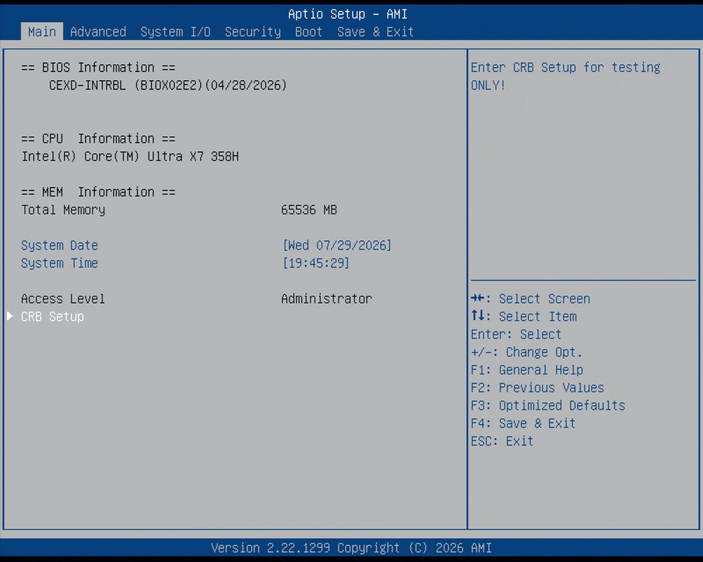
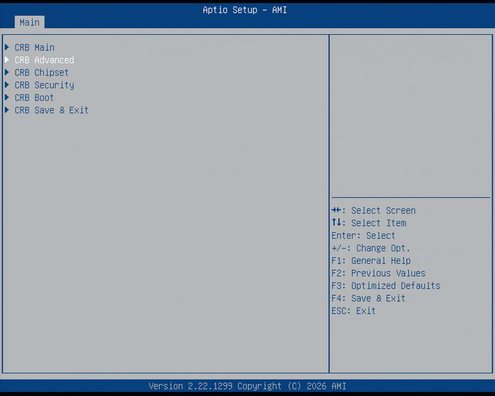
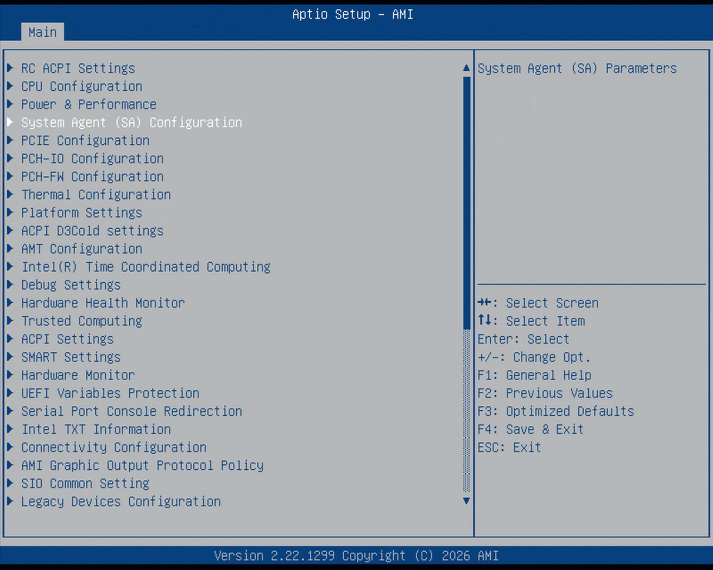
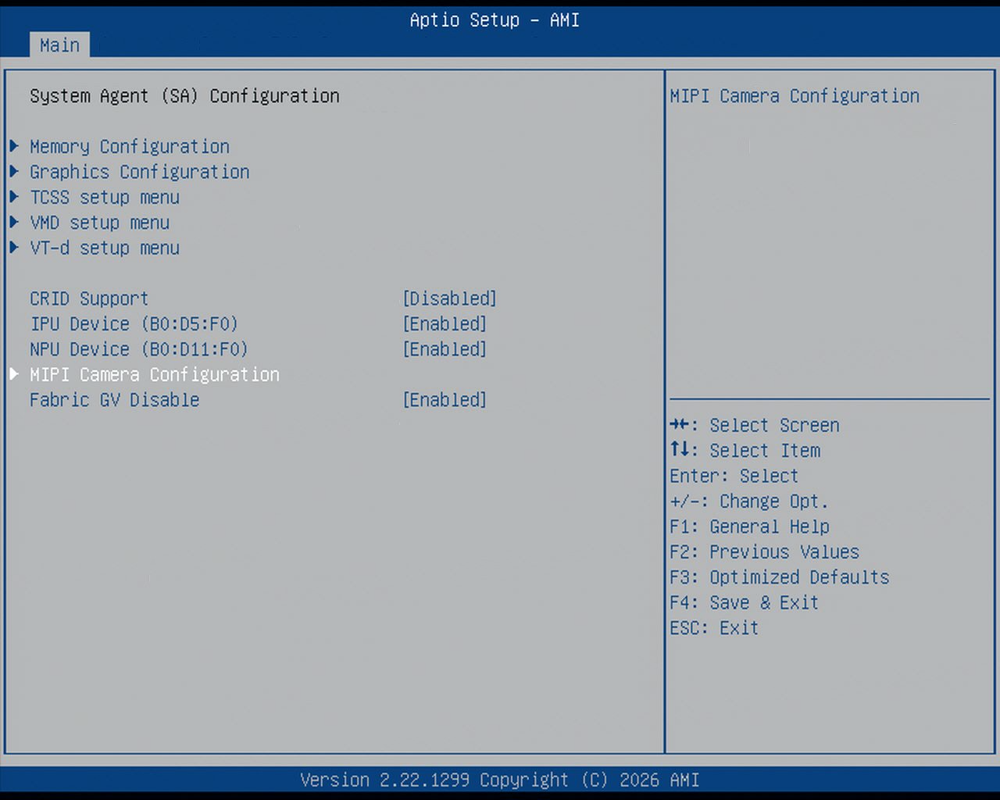

# Configure Intel® GMSL `SerDes` ACPI Devices

To enable multiple GMSL cameras, for the same or different vendors, define the MIPI camera ACPI device in UEFI/BIOS settings.

1. Review Intel®-enabled GMSL2 camera modules with their corresponding ACPI device custom HIDs:

   | ACPI custom HID | Camera module label | Sensor type         | GMSL2 serializer | Max resolution | Vendor URL                                                                             |
   | --------------- | ------------------- | ------------------- | ---------------- | -------------- | -------------------------------------------------------------------------------------- |
   | `INTC10CD`      | `d4xx`              | OV9782 + D450 Depth | MAX9295          | 2x (1280x720)  | [RealSense Depth Camera D457](https://realsenseai.com/products/d457-gmsl-fakra) |
   | `D3000004`      | `D3CMCXXX-115-084`  | ISX031              | MAX9295          | 1920x1536      | [D3 Embedded](https://www.d3embedded.com/)                                             |
   | `D3000005`      | `D3CMCXXX-106-084`  | IMX390              | MAX9295          | 1920x1080      | sensor Linux drivers package available upon `sales@d3embedded.com` camera purchase     |
   | `D3000006`      | `D3CMCXXX-089-084`  | AR0234              | MAX9295          | 1280x960       |                                                                                        |
   | `OTOC1031      | `otocam`            | ISX031              | MAX9295          | 1920x1536      | [oToBrite](https://www.otobrite.com/)                                                  |
   | `OTOC1021`      | `otocam`            | ISX021              | MAX9295          | 1920x1280      | sensor Linux drivers package available upon `sales@otobrite.com` camera purchase       |

2. AAEON CEXD-INTRBL Development Kit ACPI Table

    Images are provided to guide you to the MIPI configuration.

    
    
    
    


    Select Camera1 and `Enabled`, this should enable another option underneath called `Link options`.

    `Link Options` is where you will be update the ACPI table.

    <!--hide_directive::::{tab-set}
    :::{tab-item}hide_directive--> **RealSense™ D457**
    <!--hide_directive:sync: realsensehide_directive-->
    Below is an ACPI device configuration example for the GMSL2 RealSense Depth Camera D457:

      | UEFI Custom Sensor  | Camera 1   | Camera 2   | Camera 3   | Camera 4   |
   | ------------------- | ---------- | ---------- | ---------- | ---------- |
   | GMSL Camera suffix  | a          | g          | e          | k          |
   | Custom HID          | `INTC10CD` | `INTC10CD` | `INTC10CD` | `INTC10CD` |
   | PPR Value           | 2          | 2          | 2          | 2          |
   | PPR Unit            | 1          | 1          | 1          | 1          |
   | Position            | Back       | Back       | Front      | Front      |
   | Rotation            | 0          | 180        | 0          | 180        |
   | Camera module label | `d4xx`     | `d4xx`     | `d4xx`     | `d4xx`     |
   | MIPI Port (Index)   | 0          | 0          | 2          | 2          |
   | LaneUsed            | x2         | x2         | x2         | x2         |
   | Number of I2C       | 3          | 3          | 3          | 3          |
   | I2C Channel         | I2C0       | I2C0       | I2C1       | I2C1       |
   | Device0 I2C Address | 12         | 14         | 12         | 14         |
   | Device1 I2C Address | 42         | 44         | 42         | 44         |
   | Device2 I2C Address | 27         | 27         | 27         | 27         |

    Below is an ACPI device configuration example for the GMSL2 RealSense Depth Camera D3:
    <!--hide_directive:::
    :::{tab-item}hide_directive--> **D3CMCXXX-106-084**
    <!--hide_directive:sync: d3cmc106hide_directive-->

   Below is an ACPI device configuration example for the [D3 Embedded Discovery](https://www.d3embedded.com/product/isx031-smart-camera-narrow-fov-gmsl2-unsealed/) GMSL2 camera module:


   | UEFI Custom Sensor  | Camera 1           | Camera 2           |
   | ------------------- | ------------------ | ------------------ |
   | GMSL Camera suffix   | a                  | e                  |
   | Custom HID          | `INTC031M`         | `INTC031M`         |
   | PPR Value           | 2                  | 2                  |
   | PPR Unit            | 2                  | 2                  |
   | Camera module label | `MAX92764`         | `MAX92764`         |
   | MIPI Port (Index)   | 0                  | 2                  |
   | LaneUsed            | x4                 | x4                 |
   | Number of I2C       | 3                  | 3                  |
   | I2C Channel         | I2C0               | I2C1               |
   | Device0 I2C Address | 27                 | 27                 |
   | Device1 I2C Address | 44                 | 44                 |
   | Device2 I2C Address | 54                 | 54                 |


3. GMSL Driver
    
    Once you are finished setting up the ACPI tables, reboot the system.

    After the system has been rebooted, execute the following commands to enable the GMSL drivers:

    <!--hide_directive::::{tab-set}
    :::{tab-item}hide_directive--> **IPU7
    <!--hide_directive:sync: IPUhide_directive-->

    ```sh
        sudo modprobe intel-ipu7-isys
    ```

    <!--hide_directive:::
    ::::hide_directive-->

4. GMSL Camera binding.

    Camera binding involves using `mediactl` to correctly setup the GMSL cameras, and create a symbolic link.

    There are two scripts for binding depending on the camera(s) you are using, you can find them here:

    ```sh
        /usr/share/camera/
    ```

    The following script is used for D3 and other cameras:

    ```sh
        /usr/share/camera/ipu_max9x_bind.sh
    ```

    The following scripts is used for Realsense D457, you will need to run both in the order given below:

    ```sh
        /usr/share/camera/rs_ipu_d457_bind.sh
        /usr/share/camera/rs-enum-ipu.sh
    ```
