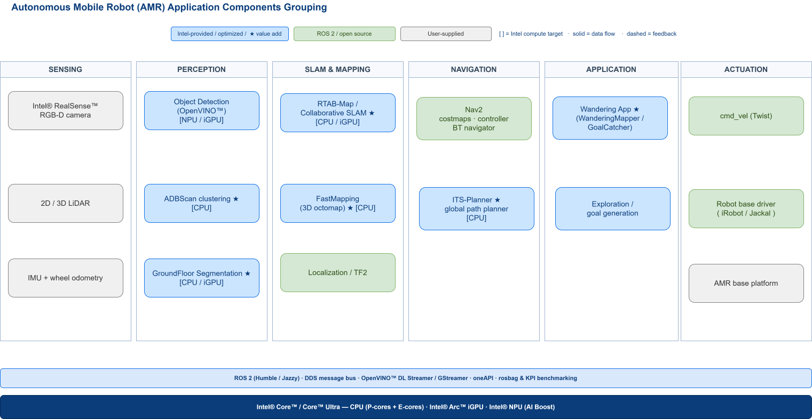
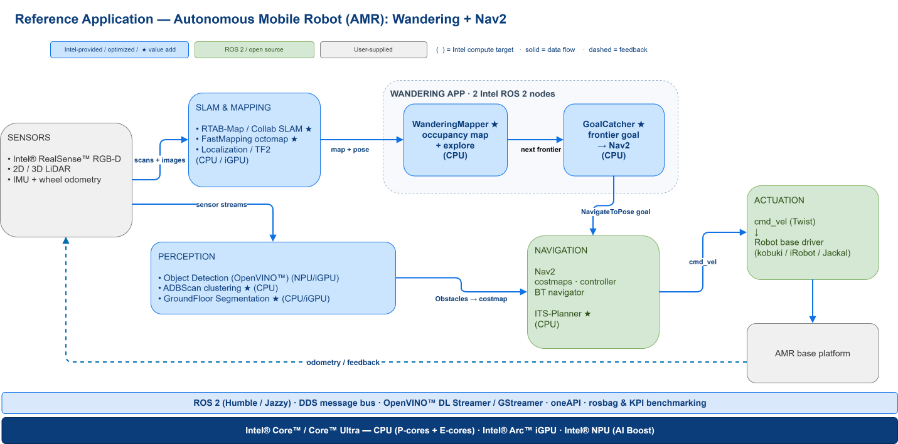

<!--hide_directive

  <a class="icon_github" href="https://github.com/open-edge-platform/edge-ai-suites/tree/release-2026.2.0/robotics-ai-suite">
     GitHub
  </a>
  <a class="icon_document" href="https://github.com/open-edge-platform/edge-ai-suites/blob/release-2026.2.0/robotics-ai-suite/docs/robotics/release-notes.md">
     Release Notes
  </a>
  <a class="icon_document" href="https://github.com/open-edge-platform/edge-ai-suites/blob/release-2026.2.0/robotics-ai-suite/README.md">
     Readme
  </a>

hide_directive-->

# Autonomous Mobile Robot

The Autonomous Mobile Robot provides software packages and pre-validated hardware modules for sensor data ingestion, classification, environment modeling, action planning, action control. Built on the (ROS 2 Humble) robot operating system, it also features reference algorithms and working examples.

Beyond autonomous mobility, this package demonstrates map building and Simultaneous Localization And Mapping (SLAM) loop closure functionality. It utilizes an open source version of visual SLAM with input from an Intel® RealSense™ camera. Optionally, the package allows you to run Light Detection and Ranging (LiDAR) based SLAM and compare those results with visual SLAM results on accuracy and performance indicators. Additionally, it detects and highlights the objects on the map. Depending on the platform that is used, workloads are executed on an integrated GPU or on Intel® CPU.

The Autonomous Mobile Robot addresses industrial, manufacturing, consumer market, and smart cities use cases, facilitating data collection, storage, and analytics across various nodes on the factory floor.
Develop, build, and deploy end-to-end mobile robot applications with this purpose-built, open, and modular software development kit that includes libraries, middleware, and sample applications based on the open source ROS 2 Humble robot operating system.

## Architecture

The Autonomous Mobile Robot collection groups its components into **sensing**, **perception**, **SLAM & mapping**, **navigation**, and the **application** layer — all on ROS 2 and accelerated on Intel® Core™ / Core™ Ultra. Intel-optimized components (marked ★) sit alongside upstream ROS 2 packages such as Nav2.

The reference `Wandering` application ties these together end-to-end. Sensors feed perception and SLAM; the Wandering application — two Intel ROS 2 nodes, `WanderingMapper` (builds the occupancy map and picks the next unexplored frontier) and `GoalCatcher` (issues `NavigateToPose` goals) — drives exploration through Nav2, while obstacles from Object Detection, ADBScan, and GroundFloor Segmentation continuously update the Nav2 costmap. Nav2 then commands the robot base.

For how this collection fits into the full stack, see the [Robotics AI Suite architecture overview](https://docs.openedgeplatform.intel.com/2026.2/ai-suite-robotics.html).

Click each icon to learn more.

<!--hide_directive
::::{grid} 1 2 2 2
:::{grid-item-card} Get Started with Autonomous Mobile Robot
:class-card: homepage-card-container-big
:link: ./gsg_robot/index.html

Install a Robot Kit.
:::

:::{grid-item-card} How it works
:class-card: homepage-card-container-big
:link: ./dev_guide/index_howitworks.html

Describes how the software works.
:::

:::{grid-item-card} Tutorials
:class-card: homepage-card-container-big
:link: ./dev_guide/index_tutorials.html

Provides a learning path for developers to use and configure Autonomous Mobile Robot.
:::

:::{grid-item-card} System Integrators
:class-card: homepage-card-container-big
:link: ./dev_guide/index_systemintegrator.html

Information specifically for System Integrators.
:::

:::{grid-item-card} GMSL Guide
:class-card: homepage-card-container-big
:link: ./dev_guide/index_gmslguide.html

Using GMSL cameras with the Autonomous Mobile Robot.
:::
::::
hide_directive-->

<!--hide_directive
:::{toctree}
:hidden:

gsg_robot/index
dev_guide/index_howitworks
dev_guide/index_tutorials
dev_guide/index_systemintegrator
GMSL Guide <dev_guide/index_gmslguide>
Release Notes <release-notes>

:::
hide_directive-->
