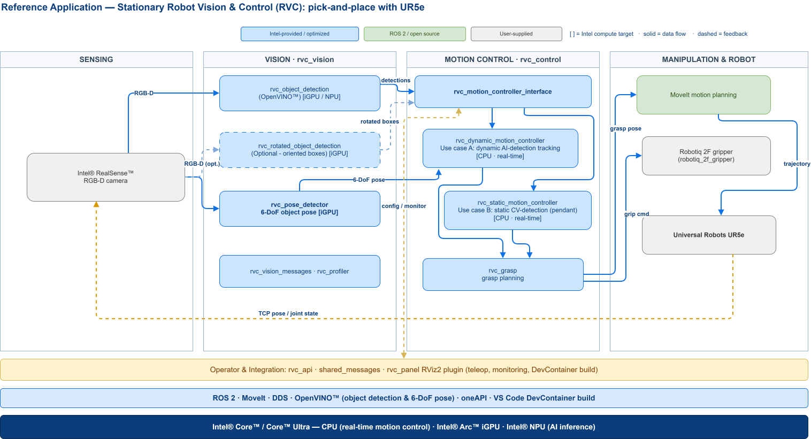

<!--hide_directive

  <a class="icon_github" href="https://github.com/open-edge-platform/edge-ai-suites/tree/release-2026.2.0/robotics-ai-suite/robot-vision-control">
     GitHub
  </a>
  <a class="icon_document" href="https://github.com/open-edge-platform/edge-ai-suites/blob/release-2026.2.0/robotics-ai-suite/docs/rvc/releasenotes.md">
     Release Notes
  </a>
  <a class="icon_document" href="https://github.com/open-edge-platform/edge-ai-suites/blob/release-2026.2.0/robotics-ai-suite/robot-vision-control/README.md">
     Readme
  </a>

hide_directive-->

# Stationary Robot

## Robotics Pick and Place in Industrial Fields

Robotics pick and place is a critical task in industrial automation where robots are employed to manipulate objects from one location to another within a manufacturing environment. This process involves the accurate identification, grasping, and relocation of items, contributing significantly to the efficiency and productivity of various industrial operations.

Stationary Robot offers a flexible and versatile framework to solve the majority of use cases in Industrial fields.

### Challenges

The robotics pick and place task presents several challenges that need to be addressed for successful implementation:

1. **Object Detection and Recognition**: Efficiently identifying objects in varying orientations, shapes, and sizes within cluttered environments is essential for successful pick and place operations.

2. **Grasping and Manipulation**: Developing robust grasping strategies to securely hold objects of different textures, weights, and fragilities is crucial for preventing dropped items and ensuring smooth manipulation.

3. **Path Planning and Navigation**: Optimizing the robot's trajectory to minimize travel time and avoid collisions with obstacles or other machinery is necessary to enhance operational efficiency and safety.

4. **Real-time Adaptation**: Ability to adapt to dynamic changes in the environment, such as variations in object position or unexpected obstacles, is essential for maintaining uninterrupted workflow.

5. **Integration with Manufacturing Systems**: Seamless integration of robotic systems with existing manufacturing processes and technologies, such as conveyors or assembly lines, is vital for achieving cohesive and synchronized operations.

### Solutions

To address the challenges associated with robotics pick and place in industrial fields, various solutions are being developed and implemented:

1. **Advanced Sensing Technologies**: Utilizing advanced sensor technologies, such as 3D vision systems and depth cameras, for accurate object detection and recognition in complex environments.

2. **Robotic Grippers and End Effectors**: Designing specialized grippers and end effectors equipped with tactile sensors and adaptive mechanisms to enhance grasping capabilities and accommodate diverse object types.

3. **Algorithmic Innovations**: Developing sophisticated algorithms for path planning, collision avoidance, and real-time decision-making to optimize robot movements and adapt to dynamic scenarios.

4. **Machine Learning and AI**: Leveraging machine learning and artificial intelligence techniques for intelligent perception, grasp planning, and adaptive control, enabling robots to learn from experience and improve performance over time.

5. **Interoperability and Connectivity**: Establishing standardized communication protocols and interfaces to facilitate seamless integration between robotic systems and existing manufacturing infrastructure, promoting interoperability and data exchange.

## Architecture

The Stationary Robot (RVC) reference application performs vision-guided pick-and-place on a Universal Robots UR5e. The `rvc_vision` package detects objects and estimates 6-DoF pose with OpenVINO™; `rvc_control` runs the real-time motion controllers — covering both the dynamic AI-detection tracking and static CV-detection use cases — together with grasp planning, driving the UR5e through MoveIt with a Robotiq gripper. Vision runs on the iGPU / NPU while motion control runs deterministically on the CPU. Supporting packages (`rvc_vision_messages`, `rvc_profiler`) and the operator plane (`rvc_api`, `rvc_panel` RViz2 plugin) sit outside the runtime data path.

For how this collection fits into the full stack, see the [Robotics AI Suite architecture overview](https://docs.openedgeplatform.intel.com/dev/ai-suite-robotics.html).

## Stationary Robot Resources

- [Get Started](getstarted.md)

- [Components and Features of RVC](components.md)

- [Exemplary Use Cases](use_cases.md)

- [Developer Resources](development.md)

- [Release Notes](releasenotes.md)

- [Troubleshooting](../troubleshooting.md)

<!--hide_directive
:::{toctree}
:maxdepth: 2
:hidden:

getstarted
components
use_cases
development
releasenotes

:::
hide_directive-->
