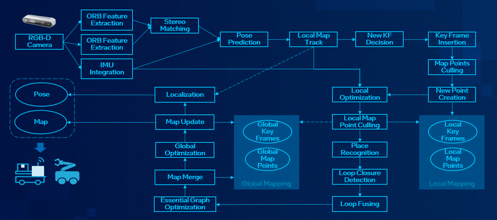
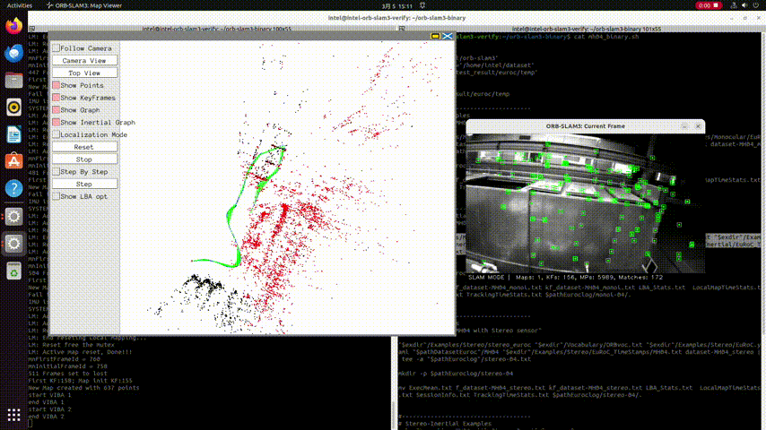
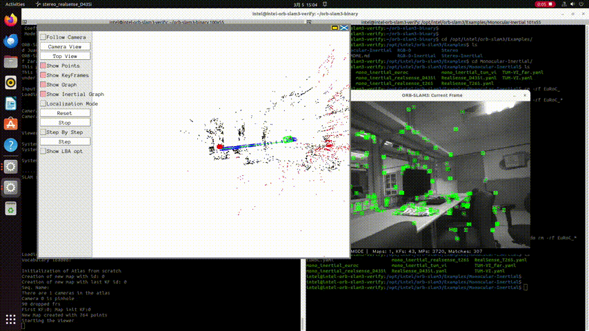

# VSLAM: ORB-SLAM3

SLAM(Simultaneous localization and mapping) is a major research problem in the robotics community, where a great deal of effort has been devoted to developing new methods to maximize their robustness and reliability.

VSLAM (visual SLAM) utilizes camera(s) as the primary source of sensor input to sense the surrounding environment. This can be done either with a single camera, multiple cameras, and with or without an inertial measurement unit (IMU) that measure translational and rotational movements.

Feature-based tracking algorithm is main-stream implementation for VSLAM, according to its real-time and simplified SLAM process.

ORB-SLAM3 is one of popular real-time feature-based SLAM libraries able to perform Visual, Visual-Inertial and Multi-Map SLAM with monocular, stereo and RGB-D cameras, using pin-hole and fisheye lens models. In all sensor configurations, ORB-SLAM3 is as robust as the best systems available in the literature, and significantly more accurate.



## Prerequisites

> [!IMPORTANT]
> Please make sure you have all the prerequisites and installation in [Installation & Setup](https://eci.intel.com/embodied-sdk-docs/content/installation_setup.html) before proceeding.
> And follow the guide [Install Realsense SDK](https://eci.intel.com/embodied-sdk-docs/content/installation_setup/installation/realsense.html) to install Realsense SDK.

## Installation

1. Make sure Realsense SDK installed. If not, follow [Install Realsense SDK](https://eci.intel.com/embodied-sdk-docs/content/installation_setup/installation/realsense.html) to install Realsense packages.

Here is a minimal installation:

```
$ sudo apt install librealsense2
```

2. Install the ORB-SLAM3 packages by following the below command:

```
$ sudo apt install orb-slam3
```

After installation, the VSLAM example programs are installed under folder ``/opt/intel/orb-slam3``.

## VSLAM Demos

### Demo-1: Monocular Camera with Mono-Dataset

This Demo uses EUROC dataset to test ORB-SLAM3 monocular mode.



1. Download the EUROC MAV Dataset files

```
$ mkdir -p ~/orb-slam3/dataset
$ cd ~/orb-slam3/dataset
$ wget http://robotics.ethz.ch/~asl-datasets/ijrr_euroc_mav_dataset/machine_hall/MH_04_difficult/MH_04_difficult.zip
$ unzip MH_04_difficult.zip -d MH04
```

> [!NOTE]
> This demo uses `MH_04_difficult dataset`. If you want to try other dataset, you may download them from the link: https://projects.asl.ethz.ch/datasets/doku.php?id=kmavvisualinertialdatasets.

2. Launch ORB-SLAM3 Demo pipeline

Run the below commands in a bash terminal:

```
$ mkdir -p ~/orb-slam3/log
$ cd ~/orb-slam3/
$ /opt/intel/orb-slam3/Examples/Monocular/mono_euroc /opt/intel/orb-slam3/Vocabulary/ORBvoc.txt /opt/intel/orb-slam3/Examples/Monocular/EuRoC.yaml ~/orb-slam3/dataset/MH04/ /opt/intel/orb-slam3/Examples/Monocular/EuRoC_TimeStamps/MH04.txt  ~/orb-slam3/log/MH04_mono.txt
```

> [!NOTE]
> If you use other datasets other than `MH_04_difficult`, you should make sure you update the command above with the correct name of dataset you use.

### Demo-2: VSLAM Demo with Intel Realsense Camera

This Demo uses Intel Realsense Camera as stereo inputs.



1. Connect a Realsense D435 or D435i Camera to the test machine

2. Launch ORB-SLAM3 Demo pipeline

Run the below command in a bash terminal:

```
$ /opt/intel/orb-slam3/Examples/Stereo/stereo_realsense_D435i /opt/intel/orb-slam3/Vocabulary/ORBvoc.txt /opt/intel/orb-slam3/Examples/Stereo/RealSense_D435i.yaml
```

